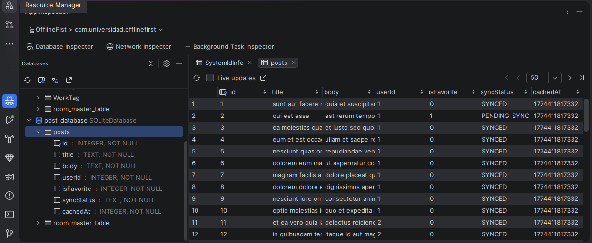
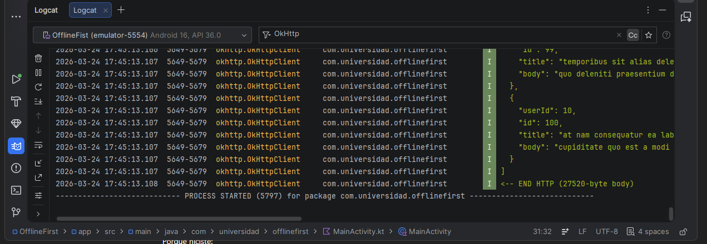
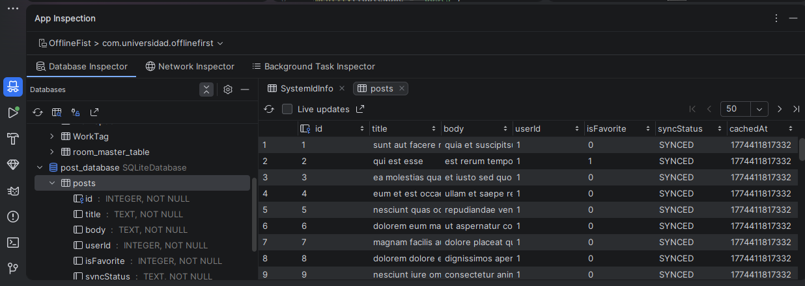
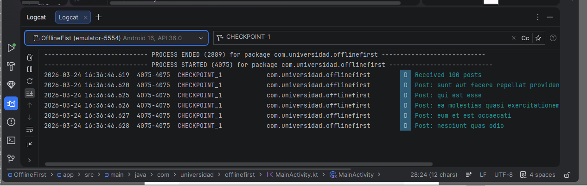
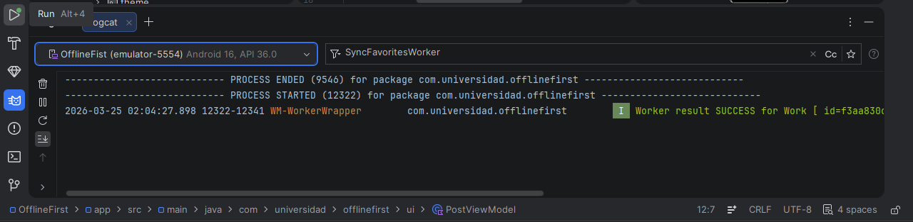

# Arquitectura Offline-First

##  Objetivo

Implementar una aplicación Android con arquitectura **offline-first**, integrando:

-  Room (base de datos local)
-  Retrofit (consumo de API)
-  TTL (control de cache)
-  WorkManager (sincronización en segundo plano)

La aplicación garantiza que la UI siempre observe datos locales, mientras la red actúa como fuente de actualización.

## Arquitectura

data/
├── local/ → Room (Entity, DAO, Database)
├── remote/ → Retrofit (API)
└── Repository → Lógica offline-first + TTL

ui/
└── ViewModel → Manejo de estado

worker/
└── WorkManager → Sincronización

---

## Flujo Offline-First

1. La UI observa datos desde **Room**
2. El Repository decide si actualizar desde la red (TTL)
3. Si no hay conexión → se muestran datos locales
4. Cambios se guardan como `PENDING_SYNC`
5. WorkManager sincroniza cuando vuelve la conexión

## TTL (Time To Live)

Se implementa un TTL de 5 minutos:

kotlin
private const val TTL_MS = 5 * 60 * 1000L

 Evita llamadas innecesarias
 Solo consulta la API cuando el cache expira

Sincronización con WorkManager
Cambios offline → PENDING_SYNC
Se encola un Worker
Al volver la red → sincroniza
Estado final → SYNCED
Validación del sistema

API responde correctamente
Datos se guardan en Room
Funciona sin conexión
TTL controla llamadas
WorkManager sincroniza automáticamente

EVIDENCIAS (IMPORTANTE PARA LA NOTA)
Consumo de API (Retrofit funcionando)

Ejecución de WorkManager

Se evidencia en Logcat la ejecución exitosa del Worker.

